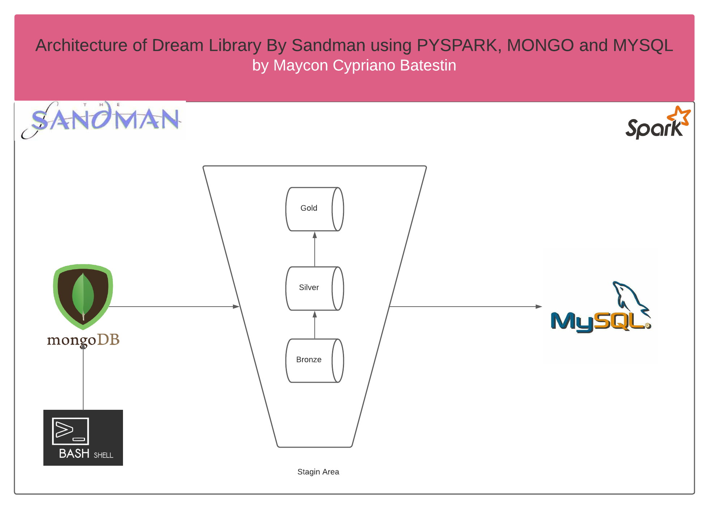
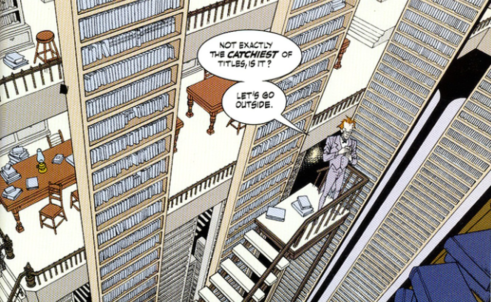

<h1 align="center">


<h3> <p align="center">BIGDATA SIMULATION LIBRARY OF DREAM BY SANDMAN BOOKS </p> </h3>
<h3> <p align="center"> ================= </p> </h3>

>> <h3> Solution Architecture </h3>




>> <h3> Description </h3>
-------------------------

<p> In the realm of Dreaming, its ruler SANDMAN, DREAM has a certain hobby; books.
In his castle there is a Library in which they are kept, among other things,
stories conceived by their authors but never written in our reality;
Lucien, the person responsible for his organization, needs some help.
Many people dream of published books, sales markets, stories that, in their reality,
they would never imagine conceiving. And this voluminous data needs to be worked on.
In order not to get lost in the information, Lucien receives all his dreams in a Non-Relational bank, MONGO.
And he needs this to be organized in a relational way, that is, each author in his proper place.
For that he pulled our dream and saw this Architecture where data arrives in MONGO
undergo a transformation process in the STAGIN area and are populated in MYSQL.
In its population, we split two final tables.
One in its raw state, for complete queries, and another with metrics that informs the number of dreamers, their books and the total number of files.
In this way, data is more organized, undergoing deduplication and consolidation processes.</p>

>> <h3> Glossary of Data </h3>
------------------------------

Fields	                                                  | Type  	  |    Description                              |
----------------------------------------------------------|:---------:|:-------------------------------------------:|
_id                          							  |long 	  | undescore ID                                |
kind													  |string     | type of book or text file                   |
title													  |string     | title of book	                            |
subtitle												  |string     | subtitle of book                            |
author													  |array      | one or more authors who can dream of stories|
publisher												  |string     | publisher or not dreamed of by the author   |
publishedDate											  |string     | year of published                           |
edition  												  |string     | which edition does the book belong to       |
sample													  |string     | sample of books	                            |
type	     											  |string     | ISBN code	                                |
identifier 												  |string     | isbn identification number                  |
pageCount												  |integer    | number of pages		                        |
capCount												  |integer    | number of chapters			                |
wordCount		   										  |integer    | number of words							    |
categories		  										  |string     | literary genre                              |
original_price 											  |double     | original price                			    |
current_prefix  										  |string     | country currency prefix                     |
current_sufix											  |string     | country currency name					    |
barcode            										  |string     | barcode	                                    |
dreaming_date                     	    				  |string     | the day you had the dream                   |

>> <h3> image </h3>
-----------------------------------



>> <h3> Start the Project </h3>
-------------------------

<p> To run the project, you need to install the dependencies located in the "dependencies" folder and in the root of the project, run the shell_script "run_script.sh". </p>


>> <h3> Sample of Payload MONGO </h3>
-------------------------
> mongo
```
{
        "_id" : ObjectId("61b1fe6944dd42158674af31"),
        "kind" : "books#volume",
        "volumeInfo" : {
                "title" : "STORE VISIT",
                "Subtitle" : "GLASS IT HAIR MEMBER KEY ALMOST QUALITY. MARKET ALREADY AIR STILL ARTICLE. DECADE DECADE MEASURE PRESENT HUMAN MORNING. BIG BLOOD ECONOMIC FRONT SUCCESS AGO THEM. EVERY SON TROUBLE SIMPLE.",
                "author" : [
                        "PETER RODRIGUEZ",
                        "KELLY TORRES"
                ]
        },
        "publisher" : "FALL AWAY ABOUT INDEPENDENT",
        "publishedDate" : "1994",
        "edition" : "7º EDITION",
        "sample" : "...onto sport room audience. page dinner hundred. week statement should watch she even ball.\nour able tv break defense seek baby. employee last around music produce reach tv..",
        "industryIdentifiers" : [
                {
                        "type" : "ISBN_10",
                        "identifier" : "1-55027-208-X"
                },
                {
                        "type" : "ISBN_10",
                        "identifier" : "0-405-30324-6"
                }
        ],
        "pageCount" : 796,
        "wordCount" : 83331,
        "capCount" : 14,
        "categories" : [
                "NOVEL"
        ],
        "saleInfo" : {
                "original_price" : 78,
                "current_prefix" : "LAK",
                "current_sufix" : "Lao kip",
                "barcode" : "6747254889534"
        }
}
```


----------------------------------------------
>> <h3> Sample of Payload in MYSQL </h3>
-------------------------
> library

```
_id  |kind        |title                                                           |subtitle                                                                                                                                                                                                                                                       |author                                       |publisher                               |publishedDate|edition   |sample                                                                                                                                                                                                     |type   |identifier       |pageCount|wordCount|capCount|categories               |original_price|current_prefix|current_sufix              |barcode      |dreaming_date|
-----+------------+----------------------------------------------------------------+---------------------------------------------------------------------------------------------------------------------------------------------------------------------------------------------------------------------------------------------------------------+---------------------------------------------+----------------------------------------+-------------+----------+-----------------------------------------------------------------------------------------------------------------------------------------------------------------------------------------------------------+-------+-----------------+---------+---------+--------+-------------------------+--------------+--------------+---------------------------+-------------+-------------+
  670|csv#volume  |GOOD DETERMINE OF                                               |DON'T HAVE                                                                                                                                                                                                                                                     |KAREN ODOM                                   |DARK WAR INDEPENDENT                    |1982         |9º EDITION|...involve star apply later including truth. next while nor worry staff economic.¶condition region write college. return half offer. popular could direction above fish..                                  |ISBN_10|978-1-4340-7508-6|      479|    64333|      11|EPISTOLARY NOVEL         |          97.0|BHD           |Bahraini dinar             |3894426059691|     20211209|

```
>> resume

```
metric          |value|
----------------+-----+
Total of Dreamns|71395|
Total of Books  |59154|
Total of Data   |78000|
```